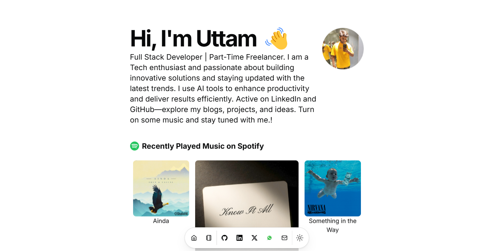

# 🌟 Portfolio Website

Welcome to my personal portfolio website! This project showcases my work, skills, and experiences in web development. It is built with modern technologies and features a clean, responsive design.

---

## ✨ Features

- **🏠 Home Page**: A visually appealing landing page with my introduction.
- **📂 Projects Section**: Showcases my top projects with links to their repositories.
- **🧑‍💻 About Section**: Highlights my skills, experience, and education.
- **📧 Contact Form**: Allows visitors to get in touch with me directly.
- **📱 Responsive Design**: Optimized for all devices including desktops, tablets, and mobiles.

---

## 🛠️ Technologies Used

- **Frontend**: React with TypeScript
- **Styling**: Tailwind CSS for a modern, responsive UI
- **Build Tool**: Vercel for deployment
- **Configuration**: ESLint and Prettier for code quality and consistency

---

## 🚀 Getting Started

### Prerequisites

Ensure you have the following installed:

- Node.js (>=14.x)
- pnpm (>=7.x)

### Installation

1. Clone the repository:
   ```bash
   git clone https://github.com/uk1619/portfolio.git
   ```

2. Navigate to the project directory:
   ```bash
   cd portfolio
   ```

3. Install dependencies:
   ```bash
   pnpm install
   ```

4. Run the development server:
   ```bash
   pnpm dev
   ```

5. Open your browser and go to `http://localhost:3000` to view the website.

---

## 📸 Screenshots

### 🖼️ Home Page


---

## 🌐 Deployment

This portfolio is deployed on **Vercel**. You can access the live version here:
[My Portfolio](https://portfolio-sand-gamma-90.vercel.app)

---

## 🤝 Contributing

Feel free to fork this repository and make improvements. To contribute:

1. Fork the repository.
2. Create a new branch (`git checkout -b feature/your-feature-name`).
3. Commit your changes (`git commit -m 'Add some feature'`).
4. Push to the branch (`git push origin feature/your-feature-name`).
5. Open a pull request.

---

## 📄 License

This project is licensed under the MIT License. See the [LICENSE](./LICENSE) file for details.

---

## 📞 Contact

If you have any questions or suggestions, feel free to reach out:

- 📧 Email: [uttamofficial005@gmail.com](mailto:uttamofficial005@gmail.com)
- 🐙 GitHub: [uk1619](https://github.com/uk1619)

---

Thank you for visiting my portfolio! 🌟

